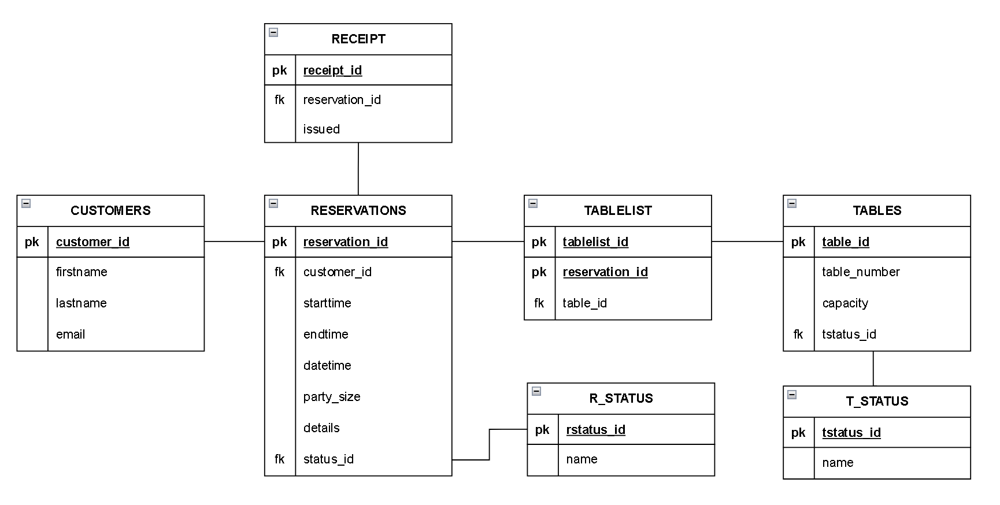
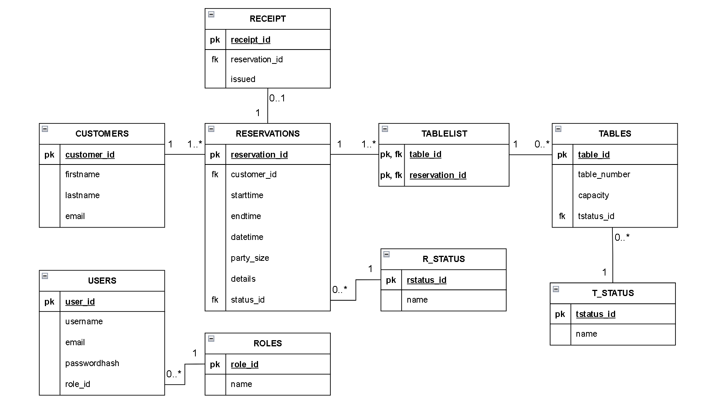

Piirretään projektin arkkitehtuuri diagrammi lopussa. Voidaan selittää se täällä auki ja lisää kaikki suoraan README.md

- Tree directory eli puukaavio, tullaan lisäämään myöhemmin.
- Mietitään luokkakaavion ja relaatiokaavio sijoittelua + tietohakemisto
- Demovideo linkki?
- Deployment link?

# Class Diagram

# ER diagram

assets\classDiagram.png

# Data Dictionary

This dictionary reflects the PostgreSQL DDL in `backend/src/main/resources/db.sql`. Unquoted table and column names are stored in lowercase by PostgreSQL.

**Constraint notation:** `PK` = primary key; `FK` = foreign key; `UQ` = unique; `NN` = not null; `IDENTITY` = generated identity value.

## 1. customers

Stores customer information.

| Column | PostgreSQL type | Constraints | Description |
|---|---|---|---|
| `customer_id` | INTEGER GENERATED ALWAYS AS IDENTITY | PK, NN | Customer identifier |
| `firstname` | VARCHAR(100) | NN | Customer's first name |
| `lastname` | VARCHAR(100) | NN | Customer's last name |
| `email` | VARCHAR(255) | NN | Customer's email address; not unique in this schema |

## 2. reservations

Stores restaurant reservations.

| Column | PostgreSQL type | Constraints | Description |
|---|---|---|---|
| `reservation_id` | INTEGER GENERATED ALWAYS AS IDENTITY | PK, NN | Reservation identifier |
| `edit_token` | VARCHAR(64) | UQ; nullable | Unique edit token when present; PostgreSQL permits multiple NULL values |
| `customer_id` | INTEGER | FK, NN | References `customers.customer_id` |
| `starttime` | TIME | NN | Reservation start time |
| `endtime` | TIME | Nullable | Reservation end time |
| `datetime` | TIMESTAMP | NN | Reservation date/time |
| `party_size` | INTEGER | NN, CHECK > 0 | Number of guests |
| `details` | TEXT | Nullable | Additional reservation notes |
| `rstatus_id` | INTEGER | FK, NN | References `r_status.rstatus_id` |

The table also has `CHECK (endtime IS NULL OR endtime >= starttime)`. Since `endtime` is nullable, the time-order check applies when an end time is provided. The schema currently has no trigger limiting active reservations per customer.

## 3. receipts

Stores receipt information. A reservation can have at most one receipt.

| Column | PostgreSQL type | Constraints | Description |
|---|---|---|---|
| `receipt_id` | INTEGER GENERATED ALWAYS AS IDENTITY | PK, NN | Receipt identifier |
| `reservation_id` | INTEGER | FK, NN, UQ | References `reservations.reservation_id`; unique to allow at most one receipt per reservation |
| `issued` | TIMESTAMP | Nullable | Date/time when the receipt was issued |

## 4. tables

Stores physical restaurant tables.

| Column | PostgreSQL type | Constraints | Description |
|---|---|---|---|
| `table_id` | INTEGER GENERATED ALWAYS AS IDENTITY | PK, NN | Table identifier |
| `table_number` | INTEGER | Nullable | Restaurant's visible table number |
| `capacity` | INTEGER | Nullable | Maximum number of guests the table can accommodate |
| `tstatus_id` | INTEGER | FK; nullable | References `t_status.tstatus_id` |

## 5. tablelist

Associative table linking reservations and tables.

| Column | PostgreSQL type | Constraints | Description |
|---|---|---|---|
| `table_id` | INTEGER | PK, FK, NN | References `tables.table_id` |
| `reservation_id` | INTEGER | PK, FK, NN | References `reservations.reservation_id` |

The composite primary key `(table_id, reservation_id)` prevents duplicate assignments of the same table to the same reservation. Neither column is unique on its own.

## 6. r_status

Lookup table for reservation statuses.

| Column | PostgreSQL type | Constraints | Description |
|---|---|---|---|
| `rstatus_id` | INTEGER GENERATED ALWAYS AS IDENTITY | PK, NN | Reservation status identifier |
| `name` | VARCHAR(50) | UQ, NN | Unique status name |

The seed data inserts `PENDING`, `CONFIRMED`, `CANCELLED`, and `COMPLETED`.

## 7. t_status

Lookup table for table statuses.

| Column | PostgreSQL type | Constraints | Description |
|---|---|---|---|
| `tstatus_id` | INTEGER GENERATED ALWAYS AS IDENTITY | PK, NN | Table status identifier |
| `name` | VARCHAR(50) | UQ, NN | Unique status name |

The seed data inserts `AVAILABLE`, `RESERVED`, `OCCUPIED`, and `OUT_OF_SERVICE`.

## 8. users

Stores application users and login information.

| Column | PostgreSQL type | Constraints | Description |
|---|---|---|---|
| `user_id` | INTEGER GENERATED ALWAYS AS IDENTITY | PK, NN | User identifier |
| `username` | VARCHAR(100) | Nullable | User's login name |
| `email` | VARCHAR(255) | Nullable | User's email address |
| `passwordhash` | VARCHAR(255) | Nullable | Hashed password representation |
| `role_id` | INTEGER | FK; nullable | References `roles.role_id` |

## 9. roles

Lookup table for application roles.

| Column | PostgreSQL type | Constraints | Description |
|---|---|---|---|
| `role_id` | INTEGER GENERATED ALWAYS AS IDENTITY | PK, NN | Role identifier |
| `name` | VARCHAR(50) | UQ, NN | Unique role name |

## Relationships

| Parent | Child | Relationship enforced by the schema |
|---|---|---|
| `customers` | `reservations` | Each reservation has one customer; a customer can have zero or more reservations |
| `r_status` | `reservations` | Each reservation has one status; a status can be used by zero or more reservations |
| `reservations` | `receipts` | A receipt has one reservation; a reservation can have zero or one receipt |
| `reservations` | `tablelist` | A table assignment has one reservation; a reservation can have zero or more assignments |
| `tables` | `tablelist` | A table assignment has one table; a table can have zero or more assignments |
| `t_status` | `tables` | A table can have zero or one status; a status can apply to zero or more tables |
| `roles` | `users` | A user can have zero or one role; a role can be assigned to zero or more users |

## Indexes

PostgreSQL automatically creates indexes to enforce primary-key and unique constraints. The SQL also defines these non-unique indexes on foreign-key columns:

| Index | Indexed column | Purpose |
|---|---|---|
| `idx_reservations_customer_id` | `reservations.customer_id` | Speeds up finding a customer's reservations and checking the reservation-to-customer foreign key |
| `idx_reservations_rstatus_id` | `reservations.rstatus_id` | Speeds up filtering or joining reservations by status and checking the status foreign key |
| `idx_tables_tstatus_id` | `tables.tstatus_id` | Speeds up filtering or joining tables by status and checking the status foreign key |
| `idx_tablelist_reservation_id` | `tablelist.reservation_id` | Speeds up finding table assignments for a reservation and checking the reservation foreign key |
| `idx_users_role_id` | `users.role_id` | Speeds up finding users by role and checking the role foreign key |

`tablelist.table_id` is the leading column of the composite primary-key index `(table_id, reservation_id)`, so it does not need a separate index for lookups by table ID.

## Overall Structure

The database contains **9 tables** and supports reservation management (`customers`, `reservations`, `receipts`), table management (`reservations`, `tablelist`, `tables`, `r_status`, `t_status`), and user management (`roles`, `users`).
