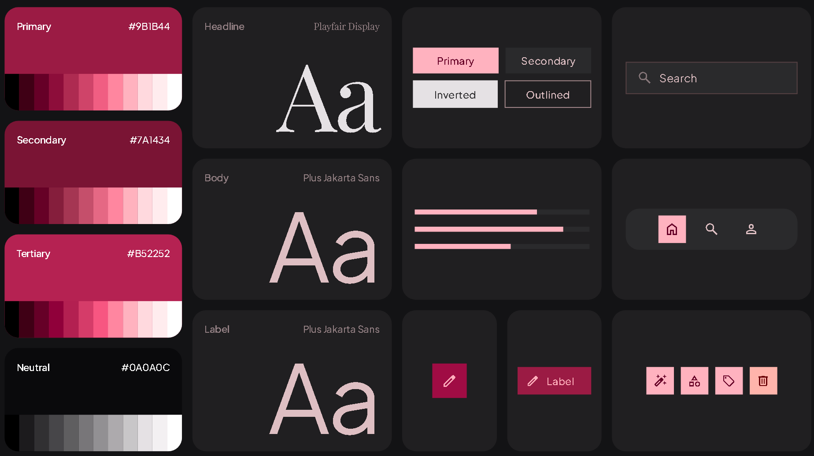

DESIGN.md was generated with stitch.ai

Previous versions of UI/UX:

- [Stitch v1](https://stitch.withgoogle.com/projects/16575207833716961824)
- [Stitch v2](https://stitch.withgoogle.com/projects/427455009647000198)
- [Stitch v3]()

name: Le Pants Theme

colors:
  surface: '#131315'
  surface-dim: '#131315'
  surface-bright: '#39393b'
  surface-container-lowest: '#0e0e10'
  surface-container-low: '#1c1b1d'
  surface-container: '#201f21'
  surface-container-high: '#2a2a2c'
  surface-container-highest: '#353437'
  on-surface: '#e5e1e4'
  on-surface-variant: '#debfc3'
  inverse-surface: '#e5e1e4'
  inverse-on-surface: '#313032'
  outline: '#a68a8d'
  outline-variant: '#574144'
  surface-tint: '#ffb2bf'
  primary: '#ffb2bf'
  on-primary: '#660027'
  primary-container: '#9b1b44'
  on-primary-container: '#ffaebb'
  inverse-primary: '#ae2b51'
  secondary: '#ffb2be'
  on-secondary: '#660126'
  secondary-container: '#88203e'
  on-secondary-container: '#ff9cae'
  tertiary: '#ffb2bf'
  on-tertiary: '#660027'
  tertiary-container: '#a00c44'
  on-tertiary-container: '#ffadbc'
  error: '#ffb4ab'
  on-error: '#690005'
  error-container: '#93000a'
  on-error-container: '#ffdad6'
  primary-fixed: '#ffd9de'
  primary-fixed-dim: '#ffb2bf'
  on-primary-fixed: '#3f0015'
  on-primary-fixed-variant: '#8d0d3a'
  secondary-fixed: '#ffd9de'
  secondary-fixed-dim: '#ffb2be'
  on-secondary-fixed: '#3f0015'
  on-secondary-fixed-variant: '#851e3c'
  tertiary-fixed: '#ffd9de'
  tertiary-fixed-dim: '#ffb2bf'
  on-tertiary-fixed: '#3f0015'
  on-tertiary-fixed-variant: '#90003a'
  background: '#131315'
  on-background: '#e5e1e4'
  surface-variant: '#353437'
typography:
  display-hero:
    fontFamily: Playfair Display
    fontSize: 72px
    fontWeight: '600'
    lineHeight: 80px
    letterSpacing: -0.02em
  display-hero-mobile:
    fontFamily: Playfair Display
    fontSize: 44px
    fontWeight: '600'
    lineHeight: 52px
    letterSpacing: -0.01em
  headline-xl:
    fontFamily: Playfair Display
    fontSize: 48px
    fontWeight: '500'
    lineHeight: 56px
    letterSpacing: -0.015em
  headline-xl-mobile:
    fontFamily: Playfair Display
    fontSize: 32px
    fontWeight: '500'
    lineHeight: 40px
    letterSpacing: 0em
  headline-lg:
    fontFamily: Playfair Display
    fontSize: 36px
    fontWeight: '400'
    lineHeight: 44px
    letterSpacing: -0.01em
  headline-lg-mobile:
    fontFamily: Playfair Display
    fontSize: 26px
    fontWeight: '400'
    lineHeight: 34px
    letterSpacing: 0em
  headline-md:
    fontFamily: Playfair Display
    fontSize: 24px
    fontWeight: '500'
    lineHeight: 32px
    letterSpacing: 0em
  body-lg:
    fontFamily: Plus Jakarta Sans
    fontSize: 18px
    fontWeight: '400'
    lineHeight: 28px
    letterSpacing: 0.01em
  body-md:
    fontFamily: Plus Jakarta Sans
    fontSize: 15px
    fontWeight: '400'
    lineHeight: 24px
    letterSpacing: 0.005em
  body-sm:
    fontFamily: Plus Jakarta Sans
    fontSize: 13px
    fontWeight: '400'
    lineHeight: 20px
    letterSpacing: 0.01em
  label-caps:
    fontFamily: Plus Jakarta Sans
    fontSize: 11px
    fontWeight: '600'
    lineHeight: 16px
    letterSpacing: 0.18em
  label-interactive:
    fontFamily: Plus Jakarta Sans
    fontSize: 14px
    fontWeight: '500'
    lineHeight: 20px
    letterSpacing: 0.04em
rounded:
  sm: 0.125rem
  DEFAULT: 0.25rem
  md: 0.375rem
  lg: 0.5rem
  xl: 0.75rem
  full: 9999px
spacing:
  gutter: 2rem
  margin: 4rem
  space-xs: 0.25rem
  space-sm: 0.5rem
  space-md: 1rem
  space-lg: 1.75rem
  space-xl: 3rem
---

## Brand & Style
The design system establishes a sultry, cinematic, and uncompromisingly high-end fine dining aesthetic. It merges old-world culinary indulgence with precision modern craftsmanship. The digital presence evokes the hushed, dramatic tension of an intimate Michelin-caliber evening: tactile materials, candlelight-level contrast, and deliberate theatrical restraint.

The target audience encompasses epicureans, luxury hospitality travelers, and design-conscious patrons who value culinary theater, curated wine programs, and exclusivity. The interface must inspire anticipation, quiet confidence, and sensory immersion rather than commercial urgency.

The visual direction combines **Cinematic Dark-Mode Minimalism** with **Tactile Editorial Luxury**:
- **Atmospheric Depths:** True-black foundation surfaces punctuated by layered charcoal and dark zinc cards, creating stage-lit focal points.
- **Controlled Drama:** Monolithic typography contrasted with whispering micro-labels and sharp hairline partitions.
- **Sensory Accents:** Sparing use of deep, velvety wine-red tones reserved strictly for primary actions, critical culinary highlights, and key interactive moments.

## Colors
The palette is built upon deep ambient darkness punctuated by rich vinous reds and surgical typographic contrast.

### Palette Architecture
- **Canvas Base (`#0A0A0C`):** The foundational absolute darkness for main page viewports.
- **Surface Elevation 1 (`#121215`):** Recessed panels, modal underlays, and structural full-width sections.
- **Surface Card / Elevation 2 (`#18181D`):** Elevated cards, elevated interactive trays, and floating menu panels.
- **Brand Accent / Primary (`#9B1B44`):** Saturated, velvety vintage wine red. Dedicated to prominent CTAs, reservation actions, and curated highlights.
- **Primary Deep (`#7A1434`):** Pressed states, gradient anchors, and subtle active indicators.
- **Primary Bright Hover (`#B52252`):** Illuminated wine tone used exclusively for hover illumination and focused interaction.
- **Text Dominance (`#FFFFFF`):** High-clarity white reserved for editorial titles, dish names, and critical prices.
- **Text Body (`#E4E4E7`):** Refined zinc offering legible softness across multi-line copy and culinary narratives.
- **Text Muted (`#A1A1AA`):** Subdued metallic zinc for categories, ingredients, provenance notes, and metadata.
- **Hairline Borders (`#27272A` & `#3F3F46`):** Precision containment dividers providing structural definition without visual weight.

## Typography
The typographic rhythm balances editorial romanticism with brutal culinary utility. 

- **Playfair Display** commands the titles, section preludes, and course announcements. Its high-contrast strokes and sculpted serifs channel luxury print publications and Michelin menus. Italics are used intentionally on hero keywords and French culinary expressions to add intimacy.
- **Plus Jakarta Sans** provides a contemporary, geometrically refined foundation for tasting notes, booking forms, price listings, and structural UI elements. It maintains pristine legibility against low-luminance backdrops.
- **Micro-Editorial Labels (`label-caps`):** Must always be set uppercase with wide letter tracking (`0.18em`), paired with subdued zinc (`#A1A1AA`) for course tiers, origin stamps, and dietary indicators.

## Layout & Spacing
The layout model employs a 12-column responsive fluid grid with generous vertical cadence, allowing imagery and culinary prose ample breathing room.

### Breakpoints & Canvas Bounds
- **Desktop (1200px+):** Max page container of 1440px. 12-column grid, `gutter: 2rem` (32px), `margin: 4rem` (64px). Vertical section spacing scales between `6rem` (96px) and `8rem` (128px) to establish museum-like pacing.
- **Tablet (768px – 1199px):** 8-column grid, `gutter: 1.5rem` (24px), `margin: 2.5rem` (40px). Imagery stacks beneath or beside descriptions in alternating balance.
- **Mobile (< 768px):** 4-column grid, `gutter: 1rem` (16px), `margin: 1.25rem` (20px). Full horizontal bleed for curated dish photography; narrative content stacks vertically with unified left alignment.

Content must never feel crowded. Negative space functions as a structural tier of luxury, separating wine pairings, tasting journeys, and reservation flows into isolated sensory beats.

## Elevation & Depth
Elevation is realized through low-key luminescence and razor-thin borders rather than aggressive drop shadows.

- **Surface Tiers:**
  - `Level 0 (Canvas)`: `#0A0A0C`
  - `Level 1 (Section Blocks)`: `#121215` with top hairline border (`1px solid #27272A`)
  - `Level 2 (Cards & Overlays)`: `#18181D` with perimeter outline (`1px solid #27272A`)
  - `Level 3 (Interactive Floating Panels)`: `#18181D` combined with a subtle inner highlight (`inset 0 1px 0 0 rgba(255, 255, 255, 0.05)`) and an ambient glow (`0 20px 40px -15px rgba(0, 0, 0, 0.7)`).
- **Wine-Tinted Bloom:** Primary focal points and primary CTA buttons cast an ultra-soft, diffused wine shadow on hover: `0 8px 30px -4px rgba(155, 27, 68, 0.35)`.
- **Glass Accents:** Navigation bars and sticky table reservation banners use a frosted glass composition (`background: rgba(10, 10, 12, 0.85)` with `backdrop-filter: blur(16px)` and bottom border `1px solid rgba(63, 63, 70, 0.4)`).

## Shapes
The shape language favors architectural sharpness and subtle refinement (`roundedness: 1`). Fine dining demands geometric discipline over playful bubbles.

- **Base Radius (0.25rem / 4px):** Applied to input fields, subtle culinary badges, chips, and small control elements.
- **Large Radius (0.5rem / 8px):** Applied to dish highlight cards, modal sheets, and atmosphere showcase frames.
- **Pill Exception (Full Round / 9999px):** Applied exclusively to floating reservation CTAs and wine vintage tag pills to provide tactile ergonomics against otherwise sharp planar geometry.

## Components

### Navigation Bar
- **Architecture:** Fixed top header with frosted backdrop blur (`rgba(10, 10, 12, 0.85)`). Height: 80px desktop, 64px mobile.
- **Logo:** High-contrast `#FFFFFF` typography pairing serif luxury display styling with wide kerning.
- **Links:** Upper-case navigation items styled with `label-caps` in `#E4E4E7`, transitioning to `#FFFFFF` with a 1px wine-red underline indicator on active or hover states.
- **Table Reservation CTA:** Wine Red `#9B1B44` button anchored on the far right.

### Buttons
- **Primary (Reservation / Booking):** Background `#9B1B44`, text `#FFFFFF`, border `1px solid #B52252`. Hover shifts background to `#B52252` with wine bloom elevation. Pressed transitions to `#7A1434`.
- **Secondary / Ghost (Menu View, Wine List):** Background transparent, border `1px solid #3F3F46`, text `#E4E4E7`. Hover initiates background tint `rgba(255, 255, 255, 0.04)` and border transition to `#E4E4E7`.
- **Text Link:** Editorial italic serif or uppercase tracked sans-serif paired with a directional hairline glyph (`→`), accented in `#B52252`.

### Culinary Highlight Cards
- Surface background `#18181D` wrapped in a fine `1px solid #27272A` border.
- Image aspect ratio locked at `4:5` or `16:10` with subtle zoom (`scale(1.03)`) on container hover.
- Header row displaying course title in `headline-md` (`#FFFFFF`), right-aligned numeric pricing in tabular figures.
- Body containing tasting notes in `body-sm` (`#E4E4E7`) over a bottom footer displaying origin badges and wine pairing recommendations in `#A1A1AA`.

### Chips & Dietary / Vintage Badges
- Compact padding (`0.25rem 0.625rem`), border `1px solid #3F3F46`, background `rgba(24, 24, 29, 0.6)`.
- Typography set to `label-caps` (`#A1A1AA`). Wine pairings adopt a soft wine tint border (`rgba(155, 27, 68, 0.4)`).

### Input Fields & Reservation Pickers
- Canvas background `#121215`, border `1px solid #27272A`, text `#FFFFFF`.
- Placeholder text in `#A1A1AA`.
- Focus state reveals a precise outline transition to `1px solid #9B1B44` alongside an inner wine glow.
- Date, time, and guest count pickers utilize pill segmented controls with `#18181D` active backgrounds.

### Story & Atmosphere Showcase
- Asymmetric dual-column arrangement: left column anchored with oversized `headline-xl` serif quote; right column featuring high-grain monochrome and ambient-lit culinary photography.
- Hairline architectural dividers (`#27272A`) frame tasting menu courses sequentially.